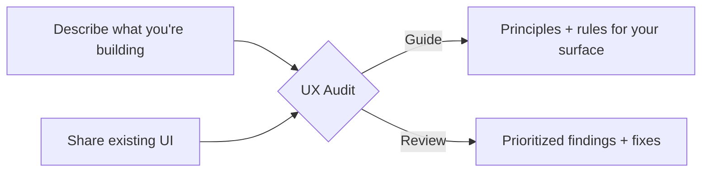

# UX Audit

**Give your AI coding assistant a design eye.**

A skill that teaches Codex, Claude Code, Cursor, and Windsurf how to think about UI/UX — so the interfaces they generate aren't just functional, but well-designed.

---

## What Is This?

AI coding assistants write good code. They don't design good interfaces. They'll miss visual hierarchy, accessible contrast, proper error states, consistent spacing, and keyboard navigation.

This skill gives them a structured framework — 12 design principles grounded in cognitive psychology, accessibility standards, and real-world UI patterns — delivered in two modes:



**Guide Mode** — you describe what you're building, you get back tailored principles with implementable do/don't rules.

```
"I'm building a settings page for a SaaS dashboard. Apply the ux-audit skill."
```

> Groups settings by mental model, layers help text, enforces accessible toggles, validates inline. [Full example](./docs/how-it-works.md#guide-mode)

**Review Mode** — you share a screenshot, HTML, or PR, you get back a structured audit.

```
"Review this onboarding flow. Use the ux-audit skill in review mode."
```

> P0: no feedback after button click. P1: 8-field form should be 1. Each with diagnosis, evidence, and fix. [Full example](./docs/how-it-works.md#review-mode)

---

## Install

### Quick install (recommended)

Interactive installer — detects your agent and sets everything up:

```bash
curl -sSL https://raw.githubusercontent.com/narenkatakam/ux-audit/main/install.sh | bash
```

Or clone and run directly:

```bash
git clone https://github.com/narenkatakam/ux-audit.git
cd ux-audit && ./install.sh
```

### Per-agent install

**Claude Code** — copy the skill into your project or global config:

```bash
# Global (all projects)
mkdir -p ~/.claude/skills/ux-audit
cp -r skills/ux-audit/* ~/.claude/skills/ux-audit/
# Then add to your CLAUDE.md: "Load skills from ~/.claude/skills/ux-audit/SKILL.md"

# Project-level
mkdir -p .claude/skills/ux-audit
cp -r skills/ux-audit/* .claude/skills/ux-audit/
```

**Cursor** — drop the rule file into your project:

```bash
mkdir -p .cursor/rules
cp .cursor/rules/ux-audit.mdc .cursor/rules/
cp -r skills/ AGENTS.md .
```

**Codex** — copy the skill and config:

```bash
cp agents/openai.yaml .
cp -r skills/ .
```

**Windsurf** — copy AGENTS.md and the skill:

```bash
cp AGENTS.md .
cp -r skills/ .
```

### Try without installing

Paste these 5 rules into your AI assistant's system prompt to test the difference:

```
1. No emoji as UI icons — use a proper icon set.
2. One primary CTA per screen, identifiable in 3 seconds.
3. Cover all states: loading, empty, error, success.
4. WCAG 2.1 AA contrast minimum on all text.
5. Spacing: 4px base unit, tight within groups, loose between.
```

If that changes how your AI builds UI, install the full skill — it has 12 principles, 10 reference docs, and structured review workflows.

### Usage

Once installed, just ask naturally:

```
"I'm building a dashboard for monitoring API usage. Apply the ux-audit skill."
"Review this component for UX issues. Use the ux-audit skill in review mode."
"Check the accessibility of this form against the ux-audit skill."
"Generate a settings page. Follow the ux-audit principles."
```

[Architecture & manual install details](./docs/architecture.md) | [Full prompt examples](./docs/how-it-works.md)

---

## What Changes

| Without the skill | With the skill |
|---|---|
| Generic layouts, no hierarchy | Task-first UX with clear primary actions |
| No accessibility consideration | WCAG 2.1 AA enforced as baseline |
| Vague "looks off" feedback | P0/P1/P2 findings with root-cause diagnosis |
| Emoji as icons, decoration-first | One icon family, every element earns its place |
| No error states or feedback | Loading, success, failure, and empty states covered |

Covers 12 domains — from cognitive psychology to CSS spacing scales. [Full coverage breakdown](./docs/coverage.md)

---

## License

[Apache License 2.0](./LICENSE.txt) — Built by [Naren Katakam](https://narenkatakam.com). Original work by [oil-oil](https://github.com/oil-oil). [Origin story](./docs/origin-story.md)
